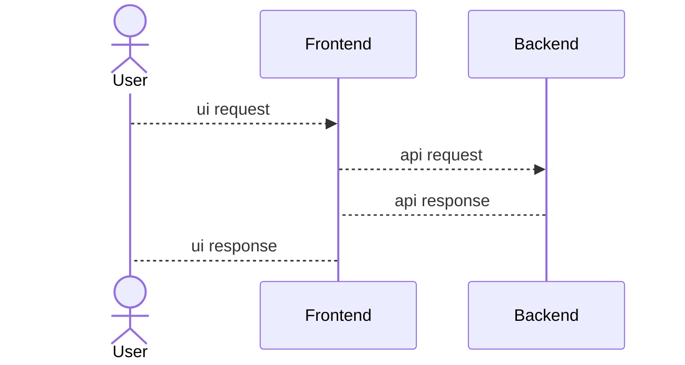
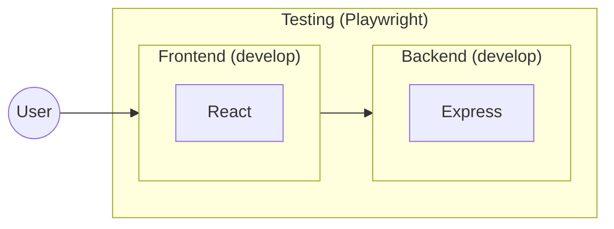
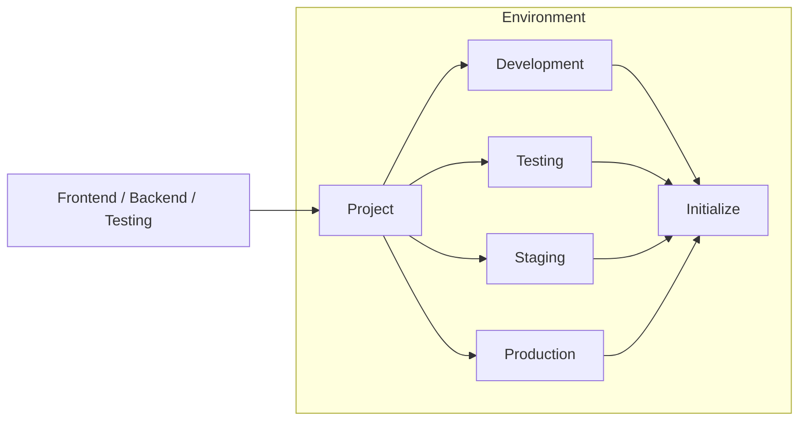

# POC #01 - React Node Setup

## System Architecture

### 1. High Level Design (HLD)

### 2. Low Level Design (LLD)

#### 2.1. Project LLD

#### 2.2. Environment LLD

## Servers & DNS

- Backend
  - Development
    - Local: [http://localhost:8001](http://localhost:8001)
    - Live: 

  - Testing
    - Local: [http://localhost:8002](http://localhost:8002)
    - Live: 

  - Staging
    - Local: [http://localhost:8003](http://localhost:8001)
    - Live: 

  - Production
    - Local: [http://localhost:8004](http://localhost:8001)
    - Live: 

- Frontend
  - Development
    - Local: [http://localhost:5173](http://localhost:5173)
    - Live: 

  - Testing
    - Local: 
    - Live: 

  - Staging
    - Local: 
    - Live: 

  - Production
    - Local: 
    - Live: 

- Testing
  - Local Report: [http://localhost:9323/](http://localhost:9323/)
  - Live Report: 

## Timeline History

- Sprint #001
  - Started: 17th Sept - 11:00
  - Ended: 
  - Total: 
