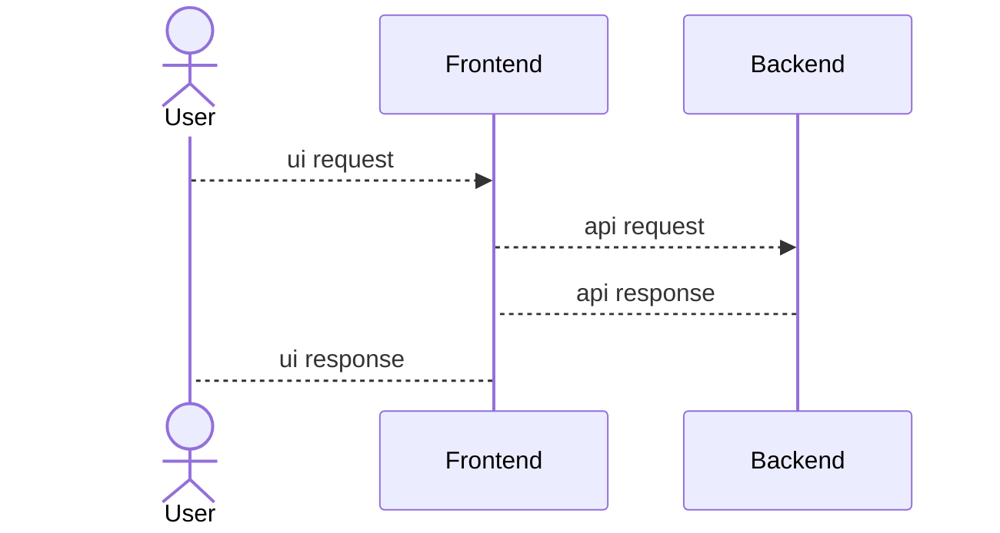
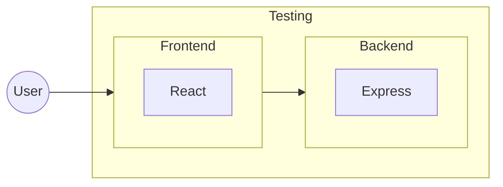

# POC #01 - React Node Setup

## System Architecture

1. High Level Design (HLD)

2. Low Level Design (LLD)

## Servers & DNS

- Backend
  - Development
    - Local: [http://localhost:8001](http://localhost:8001)
    - Live: 

  - Testing
    - Local: 
    - Live: 

  - Staging
    - Local: 
    - Live: 

  - Production
    - Local: 
    - Live: 

- Frontend
  - Development
    - Local: [http://localhost:5173](http://localhost:5173)
    - Live: 

  - Testing
    - Local: 
    - Live: 

  - Staging
    - Local: 
    - Live: 

  - Production
    - Local: 
    - Live: 

## Timeline History

- Sprint #001
  - Started: 17th Sept - 11:00
  - Ended: 
  - Total: 
